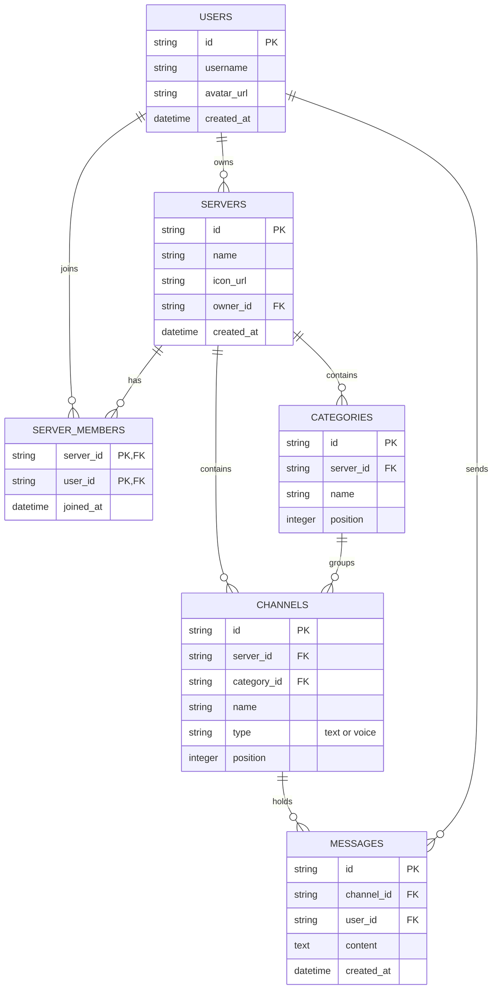
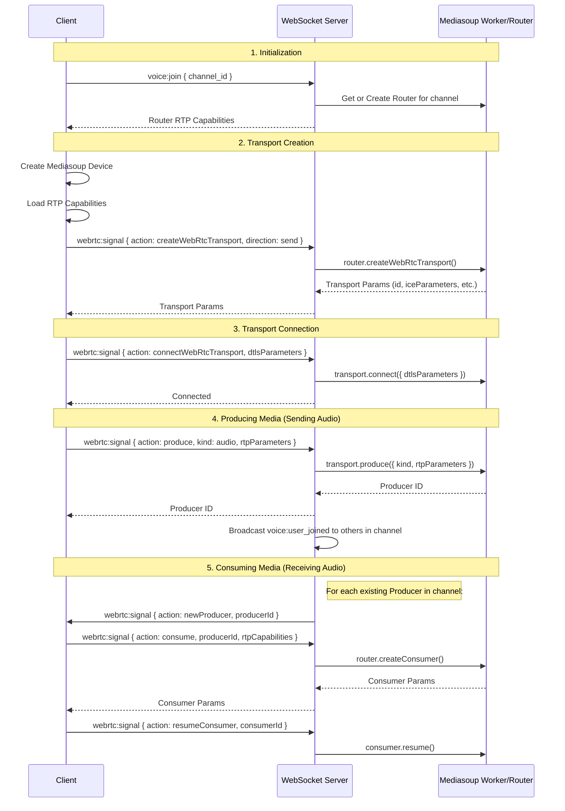
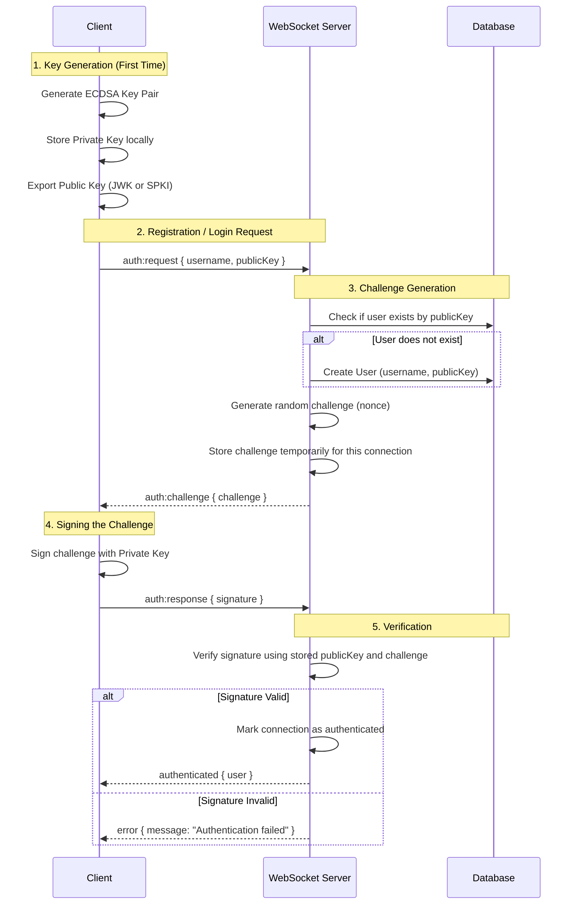

# RogueCord Architecture

This document outlines the architecture for RogueCord, a Discord clone monorepo built with TypeScript, Vue.js + Vite, Mediasoup, a native Node.js HTTPS webserver, and SQLite.

## 1. Project Structure Overview

The repository is structured as a monorepo containing both the client and server applications.

```text
roguecord/
├── client/                 # Vue.js + Vite frontend
│   ├── src/
│   │   ├── assets/         # Static assets (images, global styles)
│   │   ├── components/     # Reusable UI components (Sidebar, ServerIcon, ChatMessage)
│   │   ├── views/          # Main application views (MainLayout, ServerView)
│   │   ├── stores/         # State management (Pinia) for Users, Servers, Channels
│   │   ├── webrtc/         # Mediasoup client logic and WebRTC managers
│   │   ├── ws/             # WebSocket client wrapper
│   │   └── App.vue         # Root Vue component
│   ├── index.html
│   ├── package.json
│   └── vite.config.ts
├── server/                 # Node.js native HTTPS server
│   ├── src/
│   │   ├── db/             # SQLite database setup, migrations, and queries
│   │   ├── ws/             # WebSocket server and event handlers
│   │   ├── webrtc/         # Mediasoup server logic (routers, transports, producers, consumers)
│   │   ├── http/           # Native HTTPS request handlers (static files, basic API)
│   │   └── index.ts        # Entry point, HTTPS server setup
│   ├── certs/              # SSL/TLS certificates for HTTPS/WebRTC
│   ├── package.json
│   └── tsconfig.json
└── ARCHITECTURE.md         # This file
```

## 2. Database Schema (SQLite)

The server uses SQLite for data storage. Below is the Entity-Relationship diagram and table definitions.



### Tables
*   **`users`**: Stores user accounts.
*   **`servers`**: Represents a Discord-like server/guild.
*   **`server_members`**: Junction table linking users to the servers they have joined.
*   **`categories`**: Groups channels within a server.
*   **`channels`**: Text or voice channels. `type` distinguishes between the two.
*   **`messages`**: Chat messages sent in text channels.

## 3. API Endpoints & WebSocket Events

Since the server uses a native Node.js HTTPS server, standard HTTP endpoints are minimal, primarily serving the Vite client bundle and handling initial authentication or file uploads. Real-time communication (chat and WebRTC signaling) is handled entirely via WebSockets.

### HTTP Endpoints (Native HTTPS)
*   `GET /`: Serves the Vue.js client application.
*   `GET /assets/*`: Serves static assets.
*   `POST /api/upload`: Handles file/image uploads (e.g., server icons, avatars).

### WebSocket Events (Real-time Communication)

**Client -> Server (Requests/Actions)**
*   `auth`: Authenticate the WebSocket connection with a user token.
*   `server:create`: Create a new server (triggers the popup UI flow).
*   `server:join`: Join a server via an invite URL/code.
*   `message:send`: Send a text message to a specific `channel_id`.
*   `voice:join`: Request to join a voice `channel_id`.
*   `voice:leave`: Leave the current voice channel.
*   `webrtc:signal`: Send Mediasoup signaling data (e.g., `getRouterRtpCapabilities`, `createWebRtcTransport`, `connectWebRtcTransport`, `produce`, `consume`).

**Server -> Client (Broadcasts/Responses)**
*   `ready`: Initial state payload (user data, joined servers, channels).
*   `server:created`: Broadcasted to the creator with the new server details.
*   `server:joined`: Broadcasted when a user successfully joins a server.
*   `message:new`: Broadcasted to all members of a server when a new message is sent.
*   `voice:user_joined`: Broadcasted to users in a voice channel when someone joins.
*   `voice:user_left`: Broadcasted to users in a voice channel when someone leaves.
*   `webrtc:signal_response`: Responses to Mediasoup signaling requests.

## 4. WebRTC Signaling Flow (Mediasoup)

Mediasoup acts as a Selective Forwarding Unit (SFU). The signaling process establishes the WebRTC transports between the client and the Node.js server.



## 5. Authentication Flow (Challenge-Response)

RogueCord uses a decentralized, passwordless authentication system inspired by TeamSpeak. Instead of traditional passwords, users are identified by a cryptographic public key. The private key is generated and stored locally on the client's device (e.g., in `localStorage`).

### Cryptography
- **Algorithm**: ECDSA (Elliptic Curve Digital Signature Algorithm) with the P-256 curve, or Ed25519 if supported by the Web Crypto API.
- **Hashing**: SHA-256 for generating the challenge and hashing the public key for the user ID.

### Flow



### Database Changes
The `users` table requires a new column to store the public key.
- `public_key TEXT UNIQUE NOT NULL`

### WebSocket Payloads

**1. Client Request (`auth:request`)**
```json
{
  "type": "auth:request",
  "payload": {
    "username": "PlayerOne",
    "publicKey": "-----BEGIN PUBLIC KEY-----\nMFkwEwYHKoZIzj0CAQYIKoZIzj0DAQcDQgAE...\n-----END PUBLIC KEY-----"
  }
}
```

**2. Server Challenge (`auth:challenge`)**
```json
{
  "type": "auth:challenge",
  "payload": {
    "challenge": "a1b2c3d4e5f6g7h8i9j0k1l2m3n4o5p6q7r8s9t0u1v2w3x4y5z6" // Hex or Base64 encoded random bytes
  }
}
```

**3. Client Response (`auth:response`)**
```json
{
  "type": "auth:response",
  "payload": {
    "signature": "304502201a2b3c...022100f1e2d3..." // Hex or Base64 encoded signature
  }
}
```

**4. Server Success (`authenticated`)**
```json
{
  "type": "authenticated",
  "payload": {
    "user": {
      "id": "user-uuid",
      "username": "PlayerOne",
      "avatar_url": null,
      "created_at": "2023-10-27T10:00:00Z"
    }
  }
}
```
