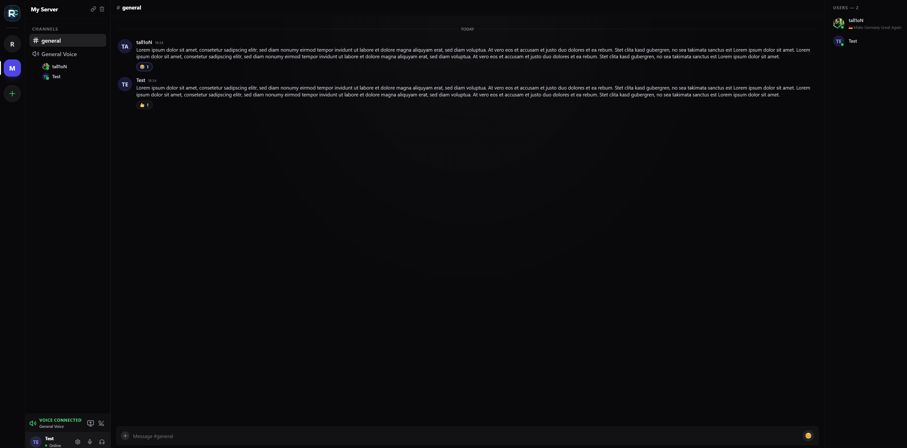
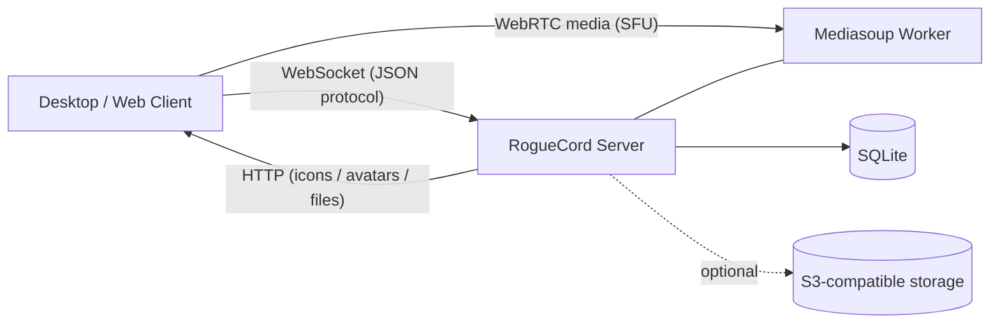

<div align="center">
   <a href="https://axios.rest"></a><br>
</div>

<p align="center">RogueCord is a self-hosted, real-time communication platform where communities can run their own standalone server instances. This repository contains both the web client and the Node.js backend</p>

<div align="center">

[](https://github.com/tall1on/roguecord/releases)
[](https://github.com/tall1on/roguecord/actions/workflows/server-build.yml)
[](https://github.com/tall1on/roguecord/actions/workflows/tauri-client-build.yml)
[](LICENSE)
[](https://nodejs.org/)
[](https://vuejs.org/)
[](https://www.typescriptlang.org/)
[](https://github.com/tall1on/roguecord/issues)
[](https://github.com/tall1on/roguecord/commits/main)

</div>

The current implementation focuses on real-time text and voice communication using WebSocket signaling, Mediasoup-based media transport, and SQLite-backed persistence.



## Quick Start

### Testing

- Test site available at: https://rc.exatek.de/
- Test server WebSocket endpoint: wss://rc1.exatek.de:1337
- Latest client and server builds available: https://github.com/tall1on/roguecord/releases


### Client

1. Download latest client build from releases: https://github.com/tall1on/roguecord/releases
2. Install for your operating system and run

### Server

Runs best on latest Linux v6 kernel based servers

1. Download latest server build from releases: https://github.com/tall1on/roguecord/releases
2. Unpack and open terminal inside the server folder
3. Install dependencies
```bash
npm ci
```
4. Setup environment variables

| Linux / Mac | Windows (PowerShell) |
|-------------|----------------------|
| <pre><code class="language-bash">cp .env.example .env && nano .env</code></pre> | <pre><code class="language-powershell">copy .env.example .env && notepad .env</code></pre> |
5. Run server
```bash
npm run start
```
6. Make sure to save your single-use admin key from console output to set up your server later
7. Connect to your server using the client (default: YOUR_SERVER_IP:1337)

All your data will be stored in the `SERVER_FOLDER/data` folder by default. Make sure to back up this folder regularly.

## Current Feature Status

This section reflects the current state of the codebase. Items marked **✅ Implemented** are functional today; items marked **🚧 Partial / In-progress** are only partially wired or rely on external infrastructure. Every entry below was verified against the server message handlers, the database schema, and the client stores.

### ✅ Implemented

| Feature | Description |
|---------|-------------|
| Passwordless authentication | Challenge/response login over WebSocket using SPKI public-key signatures (`crypto.verify`, SHA-256). Identity is a key pair; the first login auto-creates the account. |
| Realtime messaging | Live send/receive over WebSocket with per-channel history loading. |
| Replies | Messages can reply to an earlier message in the same channel; reply context (author + attachments) is included in the broadcast. |
| Message reactions | Toggle emoji reactions with aggregated reaction summaries (Twemoji picker on the client). |
| Message deletion | Authors can delete their own messages; the `manage_messages` permission allows deleting others'. |
| File attachments | Chunked uploads (begin/chunk/complete/abort) plus inline base64 attachments on messages, with size limits; stored locally or in S3. |
| Link &amp; media embeds | Outgoing messages are enriched with link previews (title, description, author, image/video media). |
| Channels &amp; categories | Create/delete/reorder channels and categories, with a default category + channel bootstrapped on first run. Channel types include text, voice, folder, and RSS. |
| Read / unread tracking | Per-user channel read state with mark-as-read up to a given message. |
| Voice channels | Mediasoup SFU lifecycle: join/leave, transport create/connect, produce/consume, mute/deafen, and voice-state synchronization. |
| Screen sharing | `getDisplayMedia` screen capture with optional system audio, selectable FPS (15/30/60), adaptive bitrate, and a join notification sound. |
| Presence &amp; profiles | Presence status plus custom status emoji and status text; editable usernames. |
| User avatars | PNG/JPG/GIF avatar upload (≤10 MB), stored locally or in S3 and served via a local route or pre-signed URL; legacy data-URL avatars are backfilled on boot. |
| Server identity &amp; settings | Single server per instance with editable title, icon (≤2 MB), rules channel, and welcome channel; a welcome message is posted on first join. |
| Roles &amp; permissions | Custom server roles with color and position-based hierarchy, eight granular permissions across Administration / Moderation / Content, built-in `admin` and `all_users` roles, role create/edit/delete/reorder, and member role assignment with hierarchy enforcement (shared client/server logic). |
| Moderation | Kick and ban by identity (public key) and/or IP, optional message-history purge, ban-rule matching at authentication, and offline enforcement applied on the target's next reconnect. |
| Folder channels | File-storage channels with list/upload/download/delete and extension + size restrictions; local or S3 storage. |
| RSS channels | Background polling of RSS/Atom feeds with content-fingerprint de-duplication; new items are posted as an RSS bot user. |
| S3-compatible storage | Optional per-server object storage (generic S3 incl. Hetzner &amp; OVH, plus Cloudflare R2) using pre-signed URLs, validation on save, and background migration of existing files. |
| Static / media serving | HTTP endpoints stream server icons, avatars, folder/attachment files, and emoji SVGs with HTTP range support; S3 objects are proxied or pre-signed. |
| Admin bootstrap | A single-use admin key is printed on first start (only when no admin exists) to claim the first admin account. |
| Connection keep-alive | WebSocket ping/pong heartbeat that terminates stale connections. |

### 🚧 Partial / In-progress

| Area | Current state |
|------|---------------|
| In-app camera / webcam video | Voice and screen sharing (with audio) are fully wired, and the media layer can carry a `camera` video source, but there is no in-app webcam capture/toggle yet. |
| Built-in TLS | The server speaks plain HTTP/WS; secure `wss://` for production is expected to come from a TLS-terminating reverse proxy in front of it, not from the server itself. |

## Architecture

RogueCord runs as a single, self-contained server instance per community. The client and server communicate primarily over a **WebSocket JSON message protocol** — almost every app action (authentication, channels, messages, reactions, uploads, roles, moderation, voice signaling, and storage settings) is a message type dispatched in [`handleMessage()`](server/src/ws/handlers.ts:1737). The same listener also serves binary assets (server icons, avatars, attachments, folder files, and emoji SVGs) over HTTP with range-request support.

Real-time voice and screen sharing run through a **Mediasoup SFU** ([`mediasoup.ts`](server/src/mediasoup.ts:1)), and all persistent state lives in a **self-migrating SQLite database** ([`db.ts`](server/src/db.ts:1)).



For a deeper component-level breakdown, see [`ARCHITECTURE.md`](ARCHITECTURE.md).

## Tech Stack

| Layer | Technologies |
|-------|--------------|
| **Desktop client** | Tauri 2 (Rust shell); bundles for Linux (deb/rpm/AppImage), Windows (NSIS), and macOS (app/dmg) |
| **Client UI** | Vue 3 (`<script setup>` Composition API), Vue Router 5, Pinia 3, TailwindCSS, `lucide-vue-next` icons, Twemoji (`twemoji` + `vue3-twemoji-picker-final`) |
| **Client build** | Vite 8, TypeScript 6, `vue-tsc`, `mediasoup-client` |
| **Server** | Node.js + TypeScript 6 (run via `ts-node`), `ws`, Mediasoup (SFU), SQLite (`sqlite3`), `dotenv` |
| **Object storage** | AWS SDK v3 (`@aws-sdk/client-s3` + `@aws-sdk/s3-request-presigner`) for S3-compatible backends with pre-signed URLs |
| **Realtime** | JSON message protocol over WebSocket + WebRTC media (SFU via Mediasoup) |

## Repository Structure

```text
roguecord/
├─ client/                      # Vue 3 + Vite + TypeScript frontend, packaged as a Tauri desktop app
│  ├─ src/
│  │  ├─ components/            # Chat, layout sidebars, and modals (server/user settings, roles, storage)
│  │  ├─ layouts/              # App shell / main layout
│  │  ├─ stores/               # Pinia stores (chat, webrtc, ...)
│  │  ├─ utils/                # Shared helpers (e.g. serverPermissions.ts)
│  │  └─ views/
│  ├─ public/svg/              # Twemoji SVG assets
│  ├─ tauri/                   # Tauri 2 desktop shell (Rust: Cargo.toml, tauri.conf.json, capabilities/)
│  └─ package.json
├─ server/                      # Node.js + TypeScript backend (run via ts-node)
│  ├─ src/
│  │  ├─ index.ts              # HTTP + WebSocket bootstrap and static/media file serving
│  │  ├─ db.ts                 # SQLite connection + self-migrating schema bootstrap
│  │  ├─ models/               # Data access + domain queries
│  │  ├─ ws/                   # Connection manager + message handlers
│  │  ├─ messages/             # Message link/media embeds
│  │  ├─ storage/              # S3 and user-avatar storage backends
│  │  ├─ permissions.ts        # Shared roles/permissions logic
│  │  ├─ mediasoup.ts          # Mediasoup worker/router/transport logic
│  │  ├─ rssPolling.ts         # RSS/Atom polling service
│  │  ├─ rssDedup.ts           # RSS de-duplication helpers
│  │  ├─ uploads.ts            # Chunked upload buffering
│  │  └─ admin.ts              # Single-use admin bootstrap key
│  ├─ data/                    # SQLite DB + local files/icons/avatars (created at runtime)
│  ├─ .env.example
│  └─ package.json
├─ .github/workflows/           # CI: server-build.yml, tauri-client-build.yml
├─ ARCHITECTURE.md
├─ CONTRIBUTING.md
├─ AGENTS.md
└─ README.md
```

## Prerequisites

- **Node.js** 18+ (20+ recommended) and **npm**.
- **Linux recommended for the server** — Mediasoup ships native worker binaries; Linux is the primary deployment target.
- **Rust toolchain + Tauri 2 prerequisites** — required only to build/run the desktop client from source (see the [Tauri prerequisites guide](https://v2.tauri.app/start/prerequisites/)). Running the client in the browser via Vite needs only Node/npm.

## Building from Source

The [Quick Start](#quick-start) above uses the prebuilt releases. To run from source instead (for development or custom builds), start the client and server in separate terminals.

### 1) Server

```bash
cd server
npm install
copy .env.example .env
npm run start
```

> The server has a single script — `start` (`ts-node src/index.ts`) — and runs directly from TypeScript without a separate build step. It prints the single-use admin key on first launch.

### 2) Client

For browser-based development against a running server:

```bash
cd client
npm install
npm run dev      # Vite dev server on http://localhost:1420
```

To run or build the Tauri desktop app:

```bash
npm run tauri:dev     # launch the desktop shell in dev mode
npm run tauri:build   # produce platform installers/bundles
```

Client scripts are defined in `client/package.json`:

| Script | Action |
|--------|--------|
| `dev` | Vite dev server (port `1420`) |
| `build` | Type-check (`vue-tsc`) + production build to `dist/` |
| `preview` | Preview the built client |
| `tauri:dev` | Run the Tauri desktop app in development |
| `tauri:build` | Build desktop bundles (deb/rpm/AppImage, NSIS, app/dmg) |

## Environment Variables (Server)

All variables are optional and have safe code defaults. The defaults below are the values the server falls back to when the variable is unset (read in [`index.ts`](server/src/index.ts:20) and [`mediasoup.ts`](server/src/mediasoup.ts:13)); the *example* values shipped in `server/.env.example` are noted where they differ.

**Network / bind**

| Variable | Description | Default (example) |
|----------|-------------|-------------------|
| `LISTEN_IP` | HTTP/WebSocket bind IP. | `0.0.0.0` (example uses `127.0.0.1`) |
| `PORT` | HTTP/WebSocket port. | `1337` |
| `MEDIASOUP_LISTEN_IP` | Mediasoup bind IP for WebRTC traffic (`0.0.0.0` for external access). | `0.0.0.0` |
| `MEDIASOUP_ANNOUNCED_IP` | Public IP/host that clients use to reach Mediasoup. | `127.0.0.1` |

**Media / WebRTC bitrate** (all parsed as positive integers; invalid values log a warning and fall back to the default)

| Variable | Description | Default |
|----------|-------------|---------|
| `MEDIA_VIDEO_START_BITRATE_KBPS` | Initial (start) video bitrate hint, kbps. | `6000` |
| `MEDIA_VIDEO_MAX_BITRATE_VP8_KBPS` | Max VP8 video bitrate, kbps. | `25000` |
| `MEDIA_VIDEO_MAX_BITRATE_H264_KBPS` | Max H.264 video bitrate, kbps. | `30000` |
| `MEDIA_VIDEO_MAX_BITRATE_VP9_KBPS` | Max VP9 video bitrate, kbps. | `35000` |
| `MEDIA_VIDEO_MAX_BITRATE_AV1_KBPS` | Max AV1 video bitrate, kbps. | `35000` |
| `MEDIA_WEBRTC_MAX_INCOMING_BITRATE_BPS` | Max incoming WebRTC transport bitrate, bps. | `50000000` |
| `MEDIA_WEBRTC_INITIAL_OUTGOING_BITRATE_BPS` | Initial outgoing WebRTC transport bitrate, bps. | `100000000` |

**RSS** (read in [`rssPolling.ts`](server/src/rssPolling.ts:227); not present in `.env.example`)

| Variable | Description | Default |
|----------|-------------|---------|
| `RSS_POLL_INTERVAL_MS` | RSS/Atom feed polling interval, ms. Values below `15000` are rejected and fall back to the default. | `120000` |

> **Note:** `server/.env.example` also lists `S3_DEFAULT_ENDPOINT`, `S3_DEFAULT_REGION`, `S3_DEFAULT_BUCKET`, and `S3_DEFAULT_PREFIX`. These are **documentation placeholders only** and are **not** read by any code — S3 settings are configured per server in the UI and stored in SQLite (see [S3-Compatible Object Storage](#s3-compatible-object-storage)).

## Networking & Ports

| Purpose | Port(s) | Notes |
|---------|---------|-------|
| HTTP + WebSocket | `PORT` (default `1337`, TCP) | Client signaling and static/media serving on a single listener. |
| Mediasoup WebRTC | `10000–10100` (UDP/TCP) | Voice and screen-sharing media. Open this range in your firewall. |

- Set `MEDIASOUP_ANNOUNCED_IP` to the **public IP/hostname** clients use to reach the server; behind NAT this must be your public address, not `127.0.0.1`, or remote WebRTC media will fail to connect.
- The server speaks plain **HTTP/WS**. For production, terminate TLS with a reverse proxy (e.g. Caddy, nginx, or Traefik) in front of it so clients can connect over `https://` / `wss://` — this is how the hosted test endpoint is served.

## Data Storage and Migrations

- All server state is persisted in SQLite at `server/data/roguecord.db` (the `data/` directory is created automatically on first run).
- Tables include `servers`, `users`, `server_roles`, `user_server_roles`, `categories`, `channels`, `messages`, `message_attachments`, `message_reactions`, `channel_read_states`, `folder_channel_files`, `rss_channel_items`, `moderation_actions`, and `ban_rules`.
- Locally stored binaries live under `server/data/` in `files/`, `server-icons/`, and `user-avatars/`.
- **Migrations are automatic and self-applying.** On startup, [`server/src/db.ts`](server/src/db.ts:1) runs `CREATE TABLE IF NOT EXISTS` for every table, then per-table migration routines that inspect `PRAGMA table_info(...)` and apply additive `ALTER TABLE ... ADD COLUMN` statements (or perform a safe create/copy/rename rebuild for structural changes). Boot blocks on `channelsSchemaReady` until all migration steps succeed, so existing databases are upgraded in place without data loss. There is no separate migration CLI or versioned migration folder.

## S3-Compatible Object Storage

File storage (folder-channel files, message attachments, user avatars, and server icons) can optionally be offloaded to an S3-compatible object store. Two backends exist:

| Backend | Behavior |
|---------|----------|
| `data_dir` *(default)* | Files are stored locally under `server/data/` (`files/`, `user-avatars/`, `server-icons/`). |
| `s3` | New files are stored in an S3-compatible object store and delivered via pre-signed URLs (or proxied with range support). |

Storage is implemented with the AWS SDK v3 (`@aws-sdk/client-s3` + `@aws-sdk/s3-request-presigner`) in [`server/src/storage/s3Storage.ts`](server/src/storage/s3Storage.ts:1). Two provider modes are selectable:

| Provider mode | Notes |
|---------------|-------|
| **Generic S3** (`generic_s3`) | Any S3-compatible endpoint. **Tested with Hetzner Object Storage and OVH Object Storage**, and expected to work with most providers thanks to pre-signed URL delivery. The server automatically tries virtual-host and path-style addressing variants (with Hetzner-specific hints) to maximize compatibility. |
| **Cloudflare R2** (`cloudflare_r2`) | Configured from an R2 URL (`https://<account>.<region>.r2.cloudflarestorage.com/<bucket>`), which is parsed into endpoint/region/bucket. |

<details>
<summary><strong>Configuration flow, delivery &amp; background migration</strong></summary>

### Configuration flow

1. Open **Server Settings → Storage** in the client UI (requires the `manage_storage_settings` permission).
   - Need Hetzner Object Storage? Create an account here: https://hetzner.cloud/?ref=JmdXQVT3XHM1
2. Choose a provider mode and enter the credentials:
   - **Generic S3:** Endpoint (e.g. `https://nbg1.your-objectstorage.com`), Region (e.g. `nbg1`), Bucket, Access Key, Secret Key, optional Prefix.
   - **Cloudflare R2:** the R2 URL plus Access Key / Secret Key.
3. Enable S3 and save.

On save, the server validates the configuration by attempting a `HeadBucket` request across the candidate endpoint / region / addressing-style combinations:

- **If validation fails:** storage stays on `data_dir` and a detailed error message is returned (including provider-specific hints).
- **If validation succeeds:** storage switches to `s3` for all **new uploads**.

### Delivery

- Reads (avatars, attachments, folder files) are served via short-lived **pre-signed GET URLs** (expiry clamped between 60 seconds and 24 hours, default 1 hour).
- The server can additionally stream/proxy S3 objects (e.g. server icons) through its own HTTP endpoints with range-request support.

### Background migration

After S3 is activated, RogueCord migrates existing `data_dir` files to S3 in the background:

- progress is tracked on the `servers` row (`storage_migration_status` / `storage_migration_total` / `storage_migration_done` and related columns);
- migrated files are flagged in SQLite (`storage_provider` / `storage_key` / `migrated_to_s3_at`) and skipped on subsequent runs;
- migration errors are logged server-side without interrupting runtime operations.

### Secrets

- S3 credentials are stored **per server in SQLite** (the `servers` table) and are **never printed to logs**.
- The `S3_DEFAULT_*` entries in `server/.env.example` are documentation placeholders only — they are **not** read by the server.

</details>

## Troubleshooting

<details>
<summary><strong>Voice connects but participants can't hear each other</strong></summary>

Mediasoup media uses UDP/TCP ports `10000–10100`. Make sure that range is open in your firewall and that `MEDIASOUP_ANNOUNCED_IP` is set to a public IP/hostname clients can reach. Behind NAT, the announced IP must be your public address — not `127.0.0.1`.
</details>

<details>
<summary><strong>The client can't connect over <code>wss://</code></strong></summary>

The server only serves plain HTTP/WS. Put a TLS-terminating reverse proxy (Caddy, nginx, Traefik, …) in front of it to expose `wss://`. For local testing you can connect directly to `ws://YOUR_SERVER_IP:PORT`.
</details>

<details>
<summary><strong>I lost the admin key</strong></summary>

The single-use admin key is printed on startup **only when no admin account exists yet**. Once it has been claimed, restarting the server will not generate a new one. Recovery requires manually clearing the existing admin association in the SQLite database under `server/data/`.
</details>

<details>
<summary><strong>Where is my data stored?</strong></summary>

Everything lives under `server/data/`: the SQLite database (`roguecord.db`) plus locally stored `files/`, `server-icons/`, and `user-avatars/`. Back up that folder to preserve your server.
</details>

## Contributing

Contributions are welcome! Please read [`CONTRIBUTING.md`](CONTRIBUTING.md) before opening a pull request. The repository also includes [`AGENTS.md`](AGENTS.md), which documents the core project conventions — Vue 3 `<script setup>`, Vite, TypeScript, Node.js, SQLite, client-side code-splitting via dynamic `import()`, and the requirement to ship forward-safe migrations whenever the database schema changes.

## Security

RogueCord uses a passwordless, public-key identity model: your private key never leaves your device, and the server only ever stores public keys. If you discover a security vulnerability, please report it responsibly via the [issue tracker](https://github.com/tall1on/roguecord/issues), and avoid sharing exploit details publicly until a fix is available.

## License

This project is licensed under the **GNU AGPL v3**. See [`LICENSE`](LICENSE) for the full text.
